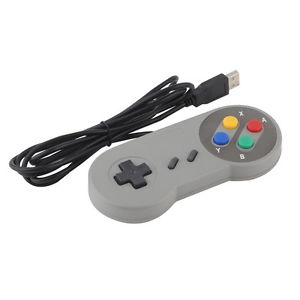

# Snes USB Controller Config for cylon-joystick

All you really need is the snes.json file in your project. To run the sample program, clone this git repo and do a `npm install`. Then run `node test-joystick.js`.

For me it works with node v0.10.33, support for new features should come soon.
